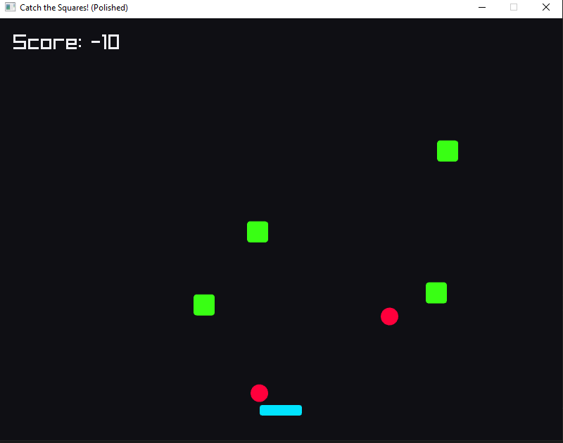

# Square Rush 🟩

A fun, fast-paced arcade catcher game built with [Zig](https://ziglang.org/) and [Raylib](https://www.raylib.com/).



## 🎮 How to Play

- **Move:** Use `Left`/`Right` arrow keys or `A`/`D`.
- **Catch the Green:** Grab the glowing neon green squares to increase your score! (+10 points)
- **Dodge the Red:** Avoid the red bomb squares! Hitting them loses you points and shakes the screen. (-30 points)
- **Survive:** The game gets faster and harder as your score goes up!

## 🚀 Build & Run

To run the game locally, make sure you have [Zig](https://ziglang.org/download/) installed.

1. Clone or download the repository.
2. In the project folder, run:
   ```bash
   zig build run
   ```

## 🛠️ Tech Stack
- **Language:** Zig
- **Graphics:** Raylib
